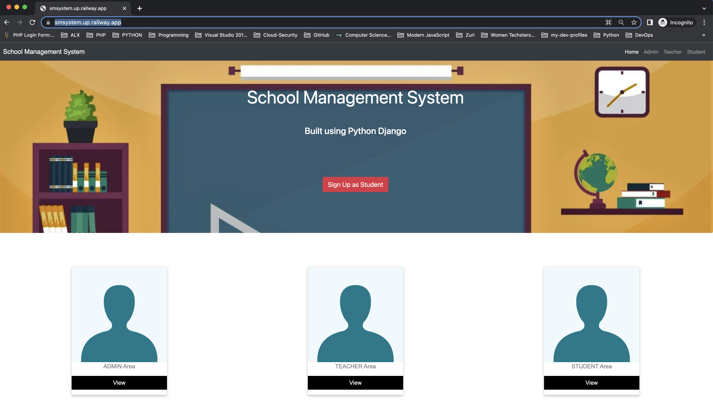
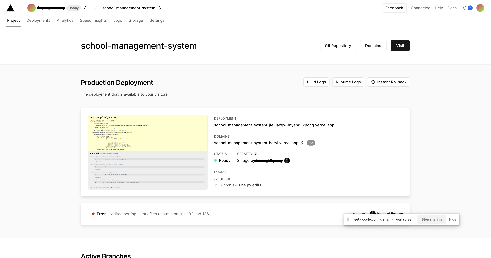

# Introduction

School Management System (SMS) is a web application that focuses on students and teachers records including student's attendance. There are three main categories of this app which are:

1. Admin Panel
2. Student's Panel and
3. Teacher's Panel.

---

## Features of School Manangement System

Student Panel
Teacher Panel
Admin Panel
Manage Requests
Student Management
Teacher Management
Student Attendance Management
View Fees, Pending
Notice Board

<https://smsystem.up.railway.app/>

You can visit the link to see how the interface of the app looks

---

## Team Members

[Inyang Ukpong](github.com/InyangUkpong) : FullStack Backend + Frontend\
[Oghenekome Igho](github.com/meetkome) : Backend + frontend\
[Joseph Bamisaye](github.com/Joethesaint) : Frontend\
Alphonsus Oshiole: Front-End

Each member is more comfortable with the roles

---

## Technologies used

- Python
- Django
- Bootstrap
- PostgreSQL
- Railway

---

## Packages/Dependencies used

- django
- django-widget-tweaks
- asgiref
- pytz
- sqlparse
- psycopg2

---

## Challenge statement

The challenges we initially faced with our the Portfolio Project was during the deployment process, we tried using pythonanywhere but got a 404 error which we couldn't resolve due to the time constraint, we later tried using vercel but due to issues it has with GitHub as we linked our Team's Project Repo, we did our research and discovered we needed to change our current database db.sqlite3 to PostgreSQL, we opted using a tool PgAdmin for Postgres but later discovered we could configure our Django app with Postgresql on vercel. After making the neccessary recommended  configurations, there we still experienced difficulties due to compatibility issues and was shown an error of improper configurations as seen below.

we tried to do some configurations f
---

Eventually we decided to try using the Railway App and also experienced some challenges during the first few tries of deployment, where we faced compatibility isssues with the version of the psycopg2 dependency in the requirements.txt, after rectifying this, we finally experienced a successful deployment.

## Available Scripts

In the project directory, you can run:

### `python3 manage.py runserver`

Runs the app in the development mode.
Open [http://localhost:8000](http://localhost:8000) to view it in your browser.

The page will reload when you make changes.\
You may also see any lint errors in the console.
